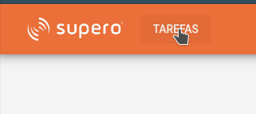
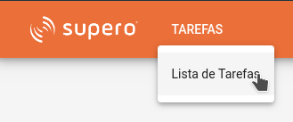
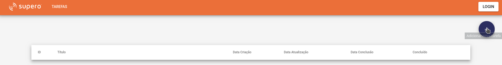
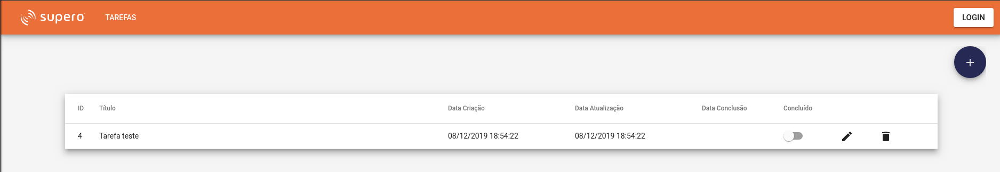

# SuperoClient

Projeto criado com [Angular CLI](https://github.com/angular/angular-cli) version 8.1.1.

## Acesso Online do Sistema 
### (Hospedado no Google Cloud Plataform, usando Container Docker)

http://tschannerl.com.br/

## Funções do Sistema
* Inclusão de uma nova tarefa
* Edição de uma tarefa
* Deleção de uma tarefa
* Mudar status (Concluído) da tarefa

* Comunicação via REST com o [SuperoServer](https://github.com/tschannerl/supero-server)

## Uso do Sistema

## Baixar git
git clone https://github.com/tschannerl/supero-client.git

## Execução Local
ng serve --open
